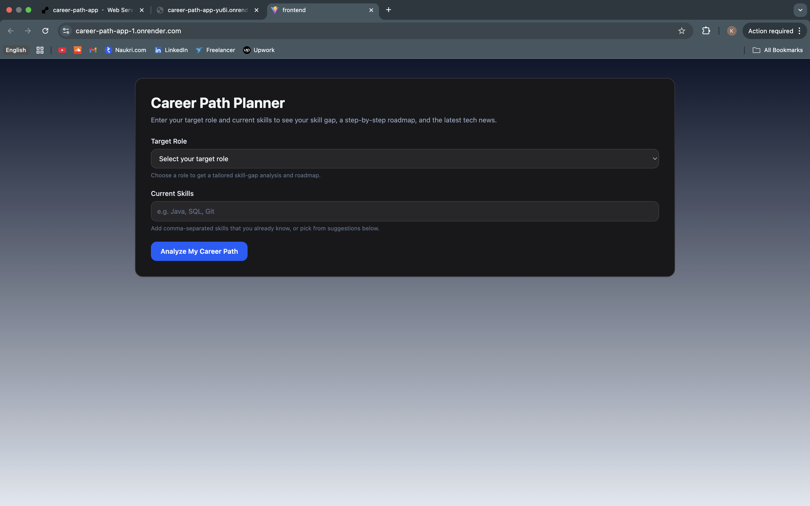
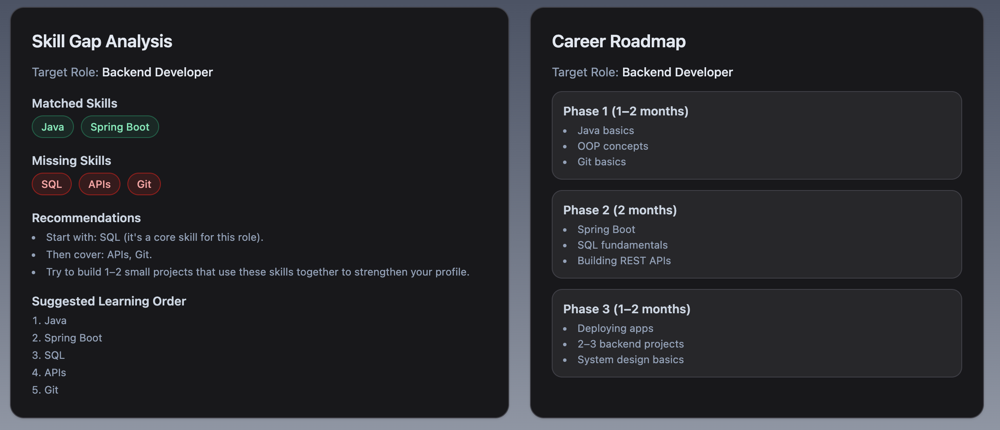
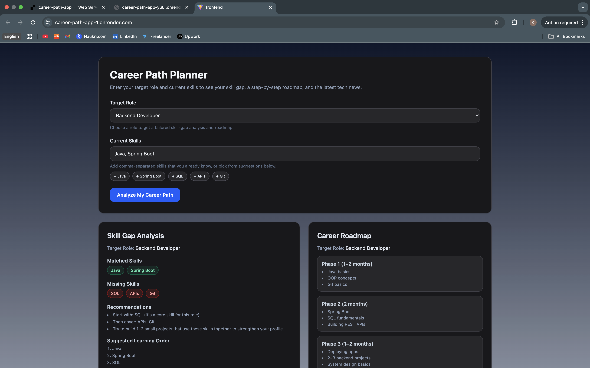
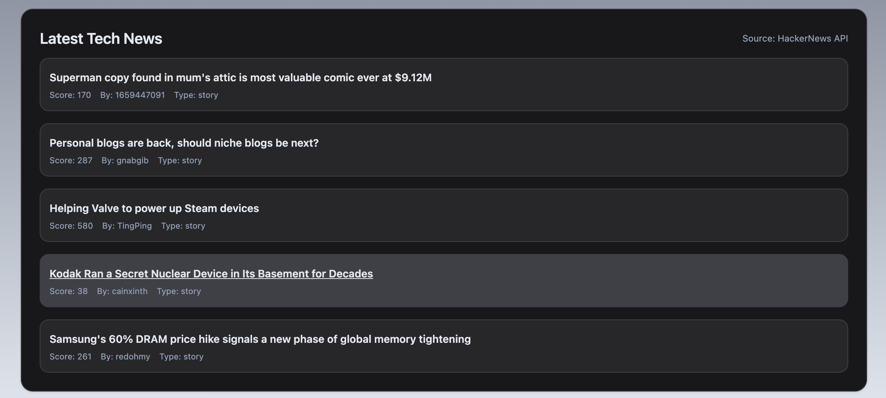

# Career Path Planner – Full Stack Assignment

A full-stack web app that analyzes a user's current skills, finds the skill gap for a target role, generates a 3-phase career roadmap, and shows the latest tech news using the public HackerNews API.  
This project fulfills all assignment requirements.

---

## 🔗 Live Demo

🚀 **Live Website:** https://career-path-app-1.onrender.com/  
🖥 **Backend API Base URL:** https://career-path-app-yu6i.onrender.com/

## 📸 Screenshots

### 🏠 Home / Input Form



### 📊 Skill Gap Analysis



### 🗺 Full Dashboard



### 📰 Latest Tech News



## 🧰 Tech Stack

### Frontend

- React (Vite)
- Tailwind CSS
- Dark theme UI
- Role dropdown + suggestion chips

### Backend

- Node.js
- Express
- Axios (for external API)
- CORS

### External API

- HackerNews public API (no key needed)

---

## 🚀 Features

### 1️⃣ Career Goal Input (Top Section)

- Target Role Dropdown: Backend Developer, Frontend Developer, Data Analyst
- Current Skills input (comma-separated)
- Auto skill suggestion chips based on selected role
  - Backend → Java, Spring Boot, SQL, APIs, Git
  - Frontend → HTML, CSS, JavaScript, React, Git
  - Data Analyst → Excel, SQL, Python, Dashboards, Statistics
- Clicking a chip adds the skill to the input (no duplicates)

---

### 2️⃣ Skill Gap Analyzer API – `POST /api/skill-gap`

Backend contains predefined role skill maps:

```js
{
  "Frontend Developer": ["HTML", "CSS", "JavaScript", "React", "Git"],
  "Backend Developer": ["Java", "Spring Boot", "SQL", "APIs", "Git"],
  "Data Analyst": ["Excel", "SQL", "Python", "Dashboards", "Statistics"]
}
```

````

**Request:**

```json
{
  "targetRole": "Backend Developer",
  "currentSkills": "Java, SQL"
}
```

**Response Example:**

```json
{
  "targetRole": "Backend Developer",
  "requiredSkills": ["Java", "Spring Boot", "SQL", "APIs", "Git"],
  "matchedSkills": ["Java", "SQL"],
  "missingSkills": ["Spring Boot", "APIs", "Git"],
  "recommendations": [
    "Start with: Spring Boot (it's a core skill for this role).",
    "Then cover: APIs, Git.",
    "Build 1–2 small projects using these skills together."
  ],
  "suggestedLearningOrder": ["Java", "Spring Boot", "SQL", "APIs", "Git"]
}
```

Frontend shows:

- Matched skills → **green chips**
- Missing skills → **red chips**
- Recommendations → **bullet list**
- Learning order → **numbered list**

---

### 3️⃣ Career Roadmap API – `POST /api/roadmap`

Mock AI-based roadmap generator.

**Request**

```json
{
  "targetRole": "Backend Developer"
}
```

**Response Example**

```json
{
  "targetRole": "Backend Developer",
  "phases": [
    {
      "phase": "Phase 1 (1–2 months)",
      "focus": ["Java basics", "OOP concepts", "Git basics"]
    },
    {
      "phase": "Phase 2 (2 months)",
      "focus": ["Spring Boot", "SQL fundamentals", "Building REST APIs"]
    },
    {
      "phase": "Phase 3 (1–2 months)",
      "focus": [
        "Deploying apps",
        "2–3 backend projects",
        "System design basics"
      ]
    }
  ]
}
```

---

### 4️⃣ Tech News – `GET /api/news`

Uses HackerNews API:

- Fetch top story IDs
- Fetch details for top 5 stories

**Response Example:**

```json
{
  "count": 5,
  "stories": [
    {
      "id": 123,
      "title": "Tech Article",
      "url": "https://example.com",
      "score": 250,
      "time": 1730000000,
      "type": "story",
      "by": "authorname"
    }
  ]
}
```

Frontend displays clickable title, score, author, type.

---

## 📂 Folder Structure

```
root/
├── backend/
│   ├── data/
│   │   ├── roleSkillsMap.js
│   │   └── roadmaps.js
│   ├── routes/
│   │   ├── skillGapRoutes.js
│   │   ├── roadmapRoutes.js
│   │   └── newsRoutes.js
│   ├── index.js
│   └── package.json
│
└── frontend/
    ├── src/
    │   ├── components/
    │   │   ├── CareerForm.jsx
    │   │   ├── SkillGapResult.jsx
    │   │   └── NewsList.jsx
    │   ├── App.jsx
    │   └── main.jsx
    ├── tailwind.config.js
    └── package.json
```

---

## 🖥 Backend Setup

```
cd backend
npm install
node index.js
```

Backend runs on:

```
http://localhost:5001
```

Endpoints:

- POST `/api/skill-gap`
- POST `/api/roadmap`
- GET `/api/news`

---

## 🎨 Frontend Setup

```
cd frontend
npm install
npm run dev
```

Runs on:

```
http://localhost:5173
```

Flow:

1. User selects role
2. Enters skills or clicks suggestion chips
3. Clicks **Analyze My Career Path**
4. Frontend calls:

   - `/api/skill-gap`
   - `/api/roadmap`
   - `/api/news`

---

## 🧩 Assumptions & Notes

- Supported roles: Backend Developer, Frontend Developer, Data Analyst
- Roadmap is static per role
- No database used (in-memory only)
- HackerNews API requires no key
- Backend & frontend are separate apps

---

## 🧪 How to Run Locally (Quick Start)

1. **Start backend**

   ```
   cd backend
   npm install
   node index.js
   ```

2. **Start frontend**

   ```
   cd frontend
   npm install
   npm run dev
   ```

3. Visit in browser:

   ```
   http://localhost:5173
   ```

---

## ✨ Future Improvements

- User accounts + saved history
- More roles (Full Stack, DevOps, ML Engineer)
- PDF export of roadmap
- Add difficulty level tags
- Fully responsive UI
````
